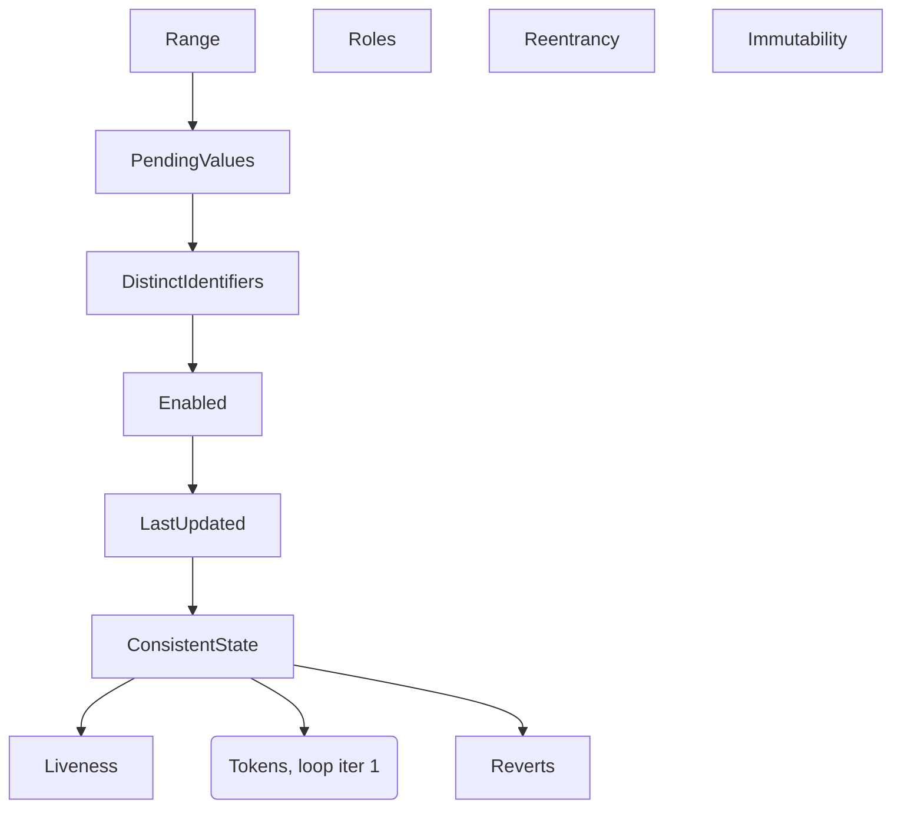

```mermaid
graph
Range --> PendingValues
PendingValues --> DistinctIdentifiers
DistinctIdentifiers --> Enabled
Enabled --> LastUpdated
LastUpdated --> ConsistentState
ConsistentState --> Liveness
ConsistentState --> Tokens(Tokens, loop iter 1)
ConsistentState --> Reverts
Roles
Reentrancy
Immutability
```
