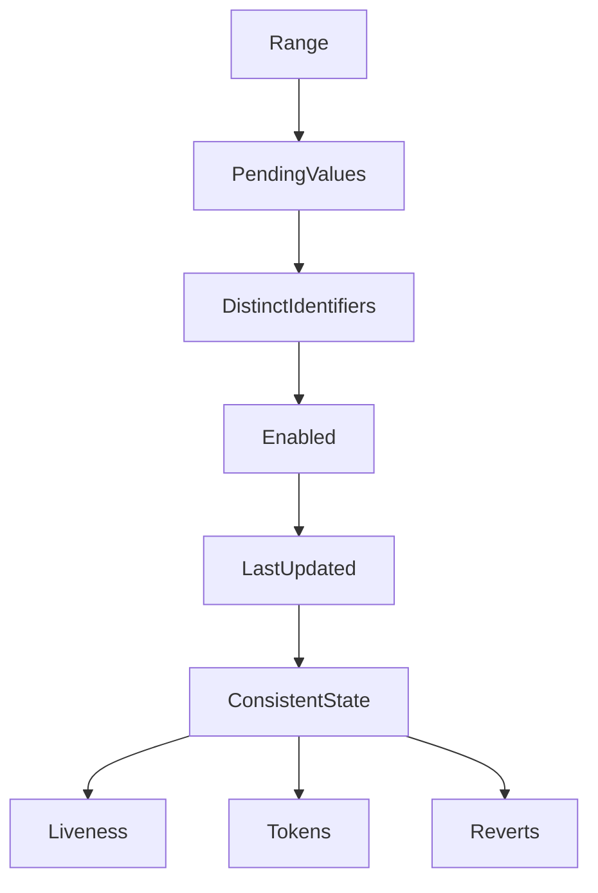

```mermaid
graph
Range --> PendingValues
PendingValues --> DistinctIdentifiers
DistinctIdentifiers --> Enabled
Enabled --> LastUpdated
LastUpdated --> ConsistentState
ConsistentState --> Liveness
ConsistentState --> Tokens
ConsistentState --> Reverts
```
