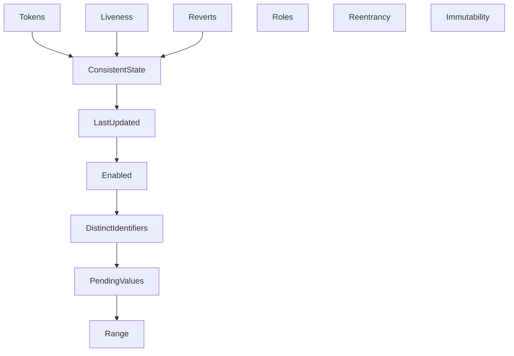

```mermaid
graph
Tokens --> ConsistentState
Liveness --> ConsistentState
Reverts --> ConsistentState
ConsistentState --> LastUpdated
LastUpdated --> Enabled
Enabled --> DistinctIdentifiers
DistinctIdentifiers --> PendingValues
PendingValues --> Range
Roles
Reentrancy
Immutability
```
