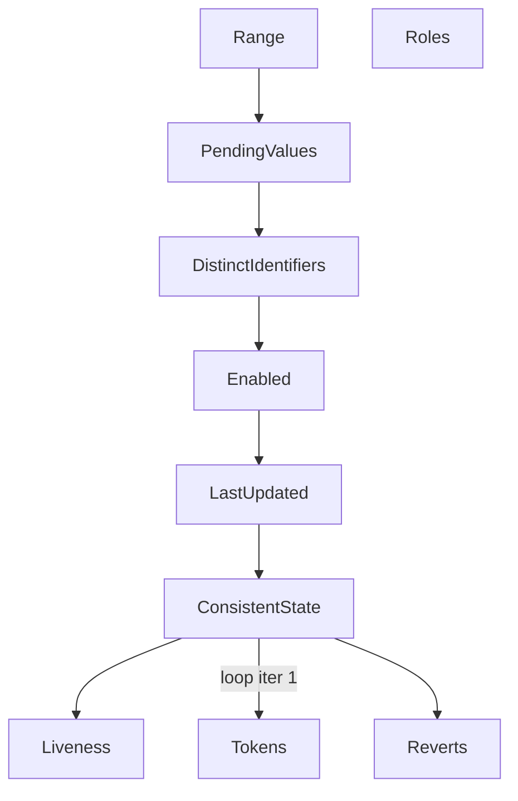

```mermaid
graph
Range --> PendingValues
PendingValues --> DistinctIdentifiers
DistinctIdentifiers --> Enabled
Enabled --> LastUpdated
LastUpdated --> ConsistentState
ConsistentState --> Liveness
ConsistentState -->|loop iter 1| Tokens
ConsistentState --> Reverts
Roles
```
